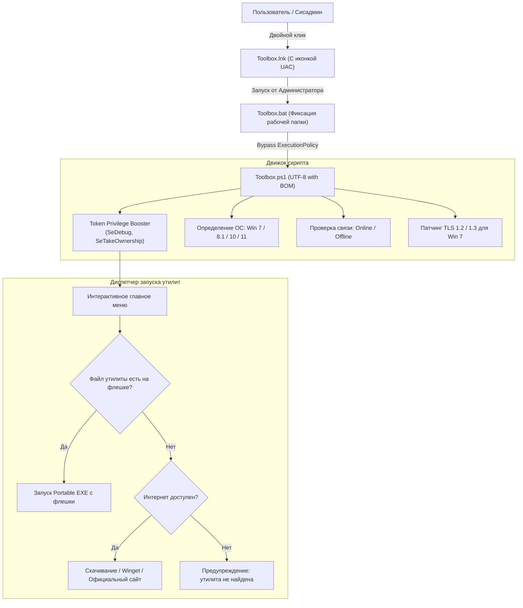

# 🧰 USB SysAdmin Universal Toolbox — Полная энциклопедия проекта (v1.5.0-beta)

> **Назначение:** Автономный швейцарский нож для выездных системных администраторов, сервисных инженеров, мастеров по ремонту ПК и продвинутых пользователей.  
> **Форм-фактор:** Мультизагрузочная флешка на базе **Ventoy** с интегрированной панелью управления Windows.  
> **Целевые ОС:** Windows 7 SP1, Windows 8.1, Windows 10, Windows 11 (21H2 — 25H2), аварийный текстовый режим для Windows XP.

---

## 📌 Оглавление
1. [Философия и ключевая концепция](#1-философия-и-ключевая-концепция)
2. [Главные фишки и ноу-хау инструмента](#2-главные-фишки-и-ноу-хау-инструмента)
3. [Архитектура и системные технологии](#3-архитектура-и-системные-технологии)
4. [Подробный каталог разделов и функций](#4-подробный-каталог-разделов-и-функций)
   - [Раздел 1: Пост-установка и софт](#раздел-1-пост-установка-и-софт)
   - [Раздел 2: Диагностика железа и тесты («Доктор ПК» и «Доктор медиа»)](#раздел-2-диагностика-железа-и-тесты)
   - [Раздел 3: Очистка и лечение](#раздел-3-очистка-и-лечение)
   - [Раздел 4: Сеть и интернет](#раздел-4-сеть-и-интернет)
   - [Раздел 5: Системные фиксы и твики](#раздел-5-системные-фиксы-и-твики)
   - [Раздел 6: Спасение данных и клонирование SSD/HDD](#раздел-6-спасение-данных-и-клонирование-ssdhdd)
   - [Раздел 7: Ускорение слабых ПК и освобождение места (Boost)](#раздел-7-ускорение-слабых-пк-и-освобождение-места-boost)
   - [Раздел 8: Перезагрузка в BIOS / UEFI](#раздел-8-перезагрузка-в-bios--uefi)
   - [Раздел 9: Пакет реанимации Windows 7](#раздел-9-пакет-реанимации-windows-7)
5. [Интеграция с Ventoy (ventoy.json)](#5-интеграция-с-ventoy-ventoyjson)
6. [Структура файлов накопителя](#6-структура-файлов-накопителя)
7. [Институциональная память (docs/solutions/)](#7-институциональная-память-docssolutions)
8. [Полевая шпаргалка мастера: сценарии быстрого решения проблем](#8-полевая-шпаргалка-мастера-сценарии-быстрого-решения-проблем)

---

## 1. Философия и ключевая концепция

При выезде на заказ или ремонте ПК в мастерской специалист сталкивается с тремя главными проблемами:
1. **Отсутствие интернета** на целевом ПК (слетели драйверы сетевой карты, заблокирован DNS, не настроен Wi-Fi).
2. **Ограничения прав доступа и блокировки Windows** (UAC, запреты групповых политик, антивирус Defender, блокирующий системные твики, нехватка прав для чтения файлов реестра).
3. **Потеря времени на рутинную диагностику** (разрозненные утилиты, необходимость гуглить коды ошибок, ручной поиск скрытых файлов мусора).

**USB SysAdmin Universal Toolbox** решает эти задачи по принципу **«Вставил флешку — запустил иконку — решил проблему в пару нажатий»**:
- Работает **полностью оффлайн** из локальной папки программ, но умеет мгновенно подтягивать свежие скрипты из сети, если интернет доступен.
- Говорит с мастером **понятными человеческими словами**, а не сухими HEX-кодами ошибок.
- Автоматически берет на себя все системные барьеры Windows.

---

## 2. Главные фишки и ноу-хау инструмента

### 🛡️ 1. Запуск в 1 клик с правами Супер-Администратора
- **Готовый ярлык `Toolbox.lnk`:** снабжен системным значком щита UAC (`SLDF_RUNAS_USER`). Запуск происходит прямо с флешки без необходимости открывать терминал от администратора вручную.
- **Встроенный Token Privilege Booster:** через Win32 API (`advapi32.dll!AdjustTokenPrivileges`) инструмент автоматически разблокирует системные права токена текущего процесса:
  - `SeDebugPrivilege` — отладка и завершение любых системных процессов.
  - `SeTakeOwnershipPrivilege` — получение прав владения защищенными файлами и ключами реестра (TrustedInstaller / SYSTEM).
  - `SeBackupPrivilege` — чтение заблокированных файлов без ограничений ACL.
- **Самоэлевация в PowerShell:** если файл `Toolbox.ps1` случайно запущен напрямую, он сам перезапустится с повышением прав через `RunAs`.

### 🩺 2. Экспресс-диагностика «Доктор ПК» (Invoke-SystemDoctor)
Автоматический 6-факторный аудит состояния системы за 5–10 секунд:
1. **Диски (SMART & NVMe):** проверка физического статуса (`PredFailure`, `Degraded`, плохие сектора).
2. **Оперативная память:** аудит аппаратных планок, объема и поиск утечек памяти (RAM Leaks > 85%).
3. **Синие экраны смерти:** парсинг папки `C:\Windows\Minidump` и журнала событий Windows (`EventID 1001` BugCheck, `EventID 1` WHEA-Logger).
4. **Целостность файлов Windows:** проверка маркеров повреждения хранилища компонентов DISM.
5. **Батарея ноутбука:** расчет коэффициента износа аккумулятора в процентах.
6. **Сеть и интернет:** проверка шлюза роутера, пинга и корректности разрешения DNS.

> **💡 Главная особенность вывода:** Вместо таблицы цифр «Доктор ПК» выдает текстовую интерпретацию:  
> *«Внимание: Обнаружены следы сбоев BugCheck (BSOD)! Причина: нестабильный драйвер или сбой ОЗУ. Нажмите кнопку [2] -> [3] для анализа дампов или [2] -> [6] для стресс-теста»*.

### 🎥 3. Доктор веб-камеры и микрофона (Invoke-WebcamMicDoctor & Fix)
Самое частое обращение пользователей («меня не слышно в Zoom / не работает камера»):
- **Аудит оборудования:** проверяет только реально подключенные устройства (`-PresentOnly`), исключая фантомные выключенные Bluetooth-гарнитуры.
- **Аудит драйверов PnP:** определяет статус устройства и выдает расшифровку кодов ошибок Диспетчера устройств (код 22 — отключено, код 28 — нет драйвера, код 19/39 — поврежден стек фильтров).
- **Аудит приватности Windows:** инспектирует ключи реестра `ConsentStore\webcam` и `ConsentStore\microphone`, выявляя системный запрет доступа приложений к медиа.
- **Шпаргалка аппаратных шторных выключателей:** подсказывает комбинации клавиш для ноутбуков (Asus `Fn + F10`, Lenovo Vantage, MSI `Fn + F6`, HP шторки).
- **Авто-фикс в 1 клик:** принудительно включает доступ в реестре, запускает отключенные устройства в PnP, перезапускает аудиослужбы `Audiosrv` / `AudioEndpointBuilder` и открывает тестовое приложение камеры.

### 🚀 4. Автоматизация Ventoy (Bypass Win11 & Aliases)
Файл `ventoy/ventoy.json` в корне флешки превращает любую установку Windows в комфортный процесс:
- **Обход требований Win 11:** автоматический пропуск проверки TPM 2.0, Secure Boot, минимума 4GB RAM и процессора.
- **Локальный аккаунт без интернета:** автоматический обход требования входа в Microsoft Account (`Bypass NRO`), позволяющий сразу создать классическую локальную учетку.
- **Красивые имена образов:** Ventoy в стартовом меню показывает не `Win11_23H2_Russian_x64v2.iso`, а понятное: `Windows 11 Pro 23H2 (x64) [Оригинальный образ]`.

### ⚡ 5. Ускорение слабых ПК и освобождение места (Boost)
- **Мгновенный возврат 8–32 ГБ на диске C:** выключение файла гибернации `powercfg -h off` удаляет огромный скрытый файл `C:\hiberfil.sys`.
- **Снятие 100% нагрузки на HDD:** отключение тяжелой фоновой службы индексирования `WSearch`.
- **Схема «Максимальная производительность» (Ultimate Performance):** активация скрытого профиля питания Windows для максимального отклика процессора.
- **Сброс битого кэша иконок:** автоматическое удаление белых/пустых значков и кэша эскизов с перезапуском Проводника.

---

## 3. Архитектура и системные технологии



### Технические стандарты кода:
1. **Кодировка UTF-8 with BOM (`utf-8-sig`):** критически важна для Windows PowerShell 5.1. Предотвращает поломку кириллицы и синтаксические ошибки парсера AST.
2. **Патчинг безопасности в рантайме:** на старых системах (Windows 7/8.1) скрипт на лету включает поддержку протоколов `Tls12 | Tls13` в `ServicePointManager`.
3. **Безопасность аргументов команд:** защита от инъекций спецсимволов при парсинге Wi-Fi профилей.
4. **Отсутствие «молчаливых падений» (No Silent Failures):** все блоки защищены `try/catch` с информативными уведомлениями об ошибках.

---

## 4. Подробный каталог разделов и функций

### Раздел 1: Пост-установка и софт
| Пункт | Название | Принцип работы и польза |
|---|---|---|
| **[1]** | **MAS Активация** | Запуск онлайн-скрипта Microsoft Activation Scripts (HWID / KMS38 / Ohook). Пожизненная цифровая привязка лицензии к железу для Windows 10/11 и вечная активация Office без сторонних файлов. |
| **[2]** | **Chris Titus WinUtil** | Легендарный комбайн для быстрой настройки свежей Windows, отключения фонового мусора и пакетной установки программ. |
| **[3]** | **Win11Debloat** | Скрипт тонкой оптимизации Windows 11: удаление встроенных предустановленных игр, промо-приложений и телеметрии. |
| **[4]** | **Базовый набор в 1 клик** | Автоматическая тихая установка джентльменского набора через Winget: Google Chrome, 7-Zip, VLC Media Player, Telegram Desktop, Notepad++. |
| **[5]** | **Установка UniGetUI** | Развертывание графического магазина программ для управления пакетами Winget, Chocolatey и Scoop. |
| **[6]** | **MS Office 2024 (Offline)** | Автономный запуск локального дистрибутива пакета Microsoft Office прямо с флешки без интернета. |
| **[7]** | **WPI / MInstAll (Offline)** | Быстрый запуск вашего комплексного оффлайн-сборника программ. |
| **[8]** | **Активатор AAct / KMS** | Запуск локального портативного оффлайн-активатора для ПК без подключения к сети. |

---

### Раздел 2: Диагностика железа и тесты
| Пункт | Название | Принцип работы и польза |
|---|---|---|
| **[0]** | **ДОКТОР ПК (Авто-диагностика)** | 6-факторный автоматический чекап здоровья системы (SMART дисков, утечки RAM, дампы BSOD/WHEA, целостность DISM, износ аккумулятора, шлюз/DNS). Выдает человеческий вердикт и подсказывает нужные кнопки. |
| **[9]** | **ВЕБКА И МИКРОФОН (Диагностика)** | Доктор медиа: аудит доступности камеры, микрофона, аппаратных ошибок PnP и ключей приватности Windows ConsentStore. |
| **[1]** | **HTML-отчет о батарее** | Генерация детального системного отчета `battery-report.html` с емкостью с завода, текущей емкостью и графиком разряда. |
| **[2]** | **Показать пароли Wi-Fi** | Чтение всех сохраненных на компьютере профилей беспроводных сетей с открытым выводом паролей (Key Content). |
| **[3]** | **Проверка дампов BSOD** | Сканирование папки `Minidump`, подсчет файлов аварийного сброса памяти и вызов анализатора BlueScreenView. |
| **[4]** | **Victoria 5.37 (HDD/SSD)** | Профессиональная диагностика накопителей: посекторное чтение, выявление бэд-блоков (тайминги >500мс) и подробный паспорт SMART. |
| **[5]** | **CrystalDiskInfo** | Экспресс-оценка температуры, процента износа SSD и общего технического состояния дисков. |
| **[6]** | **Стресс-тесты железа** | Запуск комплексного стресс-пакета (AIDA64 System Stability Test, FurMark «бублик» для GPU, OCCT). |
| **[7]** | **Snappy Driver Installer** | Оффлайн-установка недостающих драйверов из готовой базы драйвер-паков на флешке. |
| **[8]** | **Autoruns & Process Explorer** | Глубокий аудит автозагрузки, служб, планировщика задач и скрытых вредоносных процессов от Sysinternals. |

---

### Раздел 3: Очистка и лечение
| Пункт | Название | Принцип работы и польза |
|---|---|---|
| **[1]** | **Dism++ GUI комбайн** | Мощнейший графический инструмент для глубокой очистки Windows, удаления неудаляемых драйверов и создания бэкапов. |
| **[2]** | **Geek Uninstaller** | Деинсталлятор с глубоким сканированием реестра и файловой системы на предмет оставшихся «хвостов». |
| **[3]** | **Очистка Temp и кэша** | Безопасная очистка временных папок `AppData\Local\Temp`, `Windows\Temp` и кэша загрузчика обновлений `SoftwareDistribution`. |
| **[4]** | **Сжатие папки WinSxS** | Запуск команды `Dism.exe /online /Cleanup-Image /StartComponentCleanup /ResetBase` для удаления устаревших дубликатов системных файлов. |
| **[5]** | **Удаление DDU (Display Driver)** | Display Driver Uninstaller — полное удаление следов видеодрайверов NVIDIA, AMD, Intel для устранения вылетов и артефактов. |
| **[6]** | **Сканер AdwCleaner** | Быстрое удаление рекламных вирусов, назойливых баннеров в браузерах, подменных поисковиков и вредоносных тулбаров. |
| **[7]** | **Антивирус KVRT** | Kaspersky Virus Removal Tool — портативный одноразовый сканер для выявления троянов, майнеров и руткитов. |

---

### Раздел 4: Сеть и интернет
| Пункт | Название | Принцип работы и польза |
|---|---|---|
| **[1]** | **Сброс сети и DNS кэша** | Полный сброс сетевого стека: `netsh winsock reset`, `netsh int ip reset`, очистка `ipconfig /flushdns` и повторное получение адреса по DHCP. |
| **[2]** | **Скачать Zapret (YouTube/DS)** | Автоматическая загрузка актуальной сборки утилиты обхода замедления YouTube и Discord из репозитория GitHub. |
| **[3]** | **DNS Jumper 2.3** | Портативная утилита для тестирования отклика популярных DNS-серверов и переключения на самый быстрый в 1 клик. |
| **[4]** | **Синхронизация времени** | Принудительная перезагрузка службы `w32time` и синхронизация с мировыми серверами времени. Устраняет сбои SSL-сертификатов («Ваше подключение не защищено»). |
| **[5]** | **Cloudflare DNS (1.1.1.1)** | Установка быстрых и защищенных DNS-адресов Cloudflare (`1.1.1.1` и `1.0.0.1`) на активные сетевые адаптеры. |
| **[6]** | **Google DNS (8.8.8.8)** | Установка надежных публичных серверов Google DNS (`8.8.8.8` и `8.8.4.4`). |
| **[7]** | **Сброс DNS на DHCP** | Возврат автоматического получения адресов DNS-серверов от домашнего или офисного роутера. |

---

### Раздел 5: Системные фиксы и твики
| Пункт | Название | Принцип работы и польза |
|---|---|---|
| **[1]** | **Defender Control (Sordum)** | Полное отключение / включение встроенного Защитника Windows (Windows Defender) на физическом уровне в 1 клик. |
| **[2]** | **Windows Update Blocker** | Надежная блокировка авто-обновлений Windows на слабых компьютерах и ноутбуках без риска их внезапного перезапуска. |
| **[3]** | **O&O ShutUp10++** | Тонкая настройка конфиденциальности: отключение телеметрии, биометрических отчетов и фоновой активности Windows. |
| **[4]** | **Проверка SFC + DISM** | Последовательный запуск автоматического сканирования и восстановления поврежденных компонентов ОС (`sfc /scannow` + `dism RestoreHealth`). |
| **[5]** | **Сброс очереди принтера** | Принудительная остановка `Spooler`, удаление застрявших файлов печати из `system32\spool\printers` и перезапуск службы. |
| **[6]** | **Фикс ассоциаций (.exe / .lnk)** | Восстановление разрушенных ключей реестра для открытия исполняемых файлов и ярлыков (когда программы открываются блокнотом). |
| **[7]** | **Меню Win 10 в Windows 11** | Возврат классического развернутого контекстного меню по правому клику мыши (без пункта «Показать дополнительные параметры»). |
| **[8]** | **Вернуть меню Windows 11** | Откат к стандартному новому контекстному меню Windows 11. |
| **[9]** | **Включить 'Администратор'** | Активация встроенного скрытого профиля Администратора (`net user Administrator /active:yes`). |
| **[10]**| **Bypass Win11 Check** | Внесение ключей `BypassTPMCheck`, `BypassSecureBootCheck`, `BypassRAMCheck` в реестр для обновления неподдерживаемых ПК. |
| **[11]**| **Фикс вебки и микрофона** | Комплексный 1-клик фикс: снятие блокировок в реестре, включение PnP-устройств, перезапуск звука и запуск камеры. |

---

### Раздел 6: Спасение данных и клонирование SSD/HDD
| Пункт | Утилита | Применение и специфика |
|---|---|---|
| **[1]** | **DMDE 4.2** | Низкоуровневый редактор дисков и спасатель информации. Восстанавливает файлы после форматирования, сбоя таблиц MBR/GPT и повреждений файловых систем NTFS, FAT32, exFAT, Ext. |
| **[2]** | **R-Studio 9.3** | Промышленный стандарт восстановления данных с поврежденных разделов, флешек и RAID-массивов с поддержкой сигнатурного поиска (Raw File Recovery). |
| **[3]** | **AOMEI Partition Assistant** | Безопасное изменение размеров разделов, конвертация MBR в GPT без потери данных, перенос ОС на SSD. |
| **[4]** | **Acronis / Backupper** | Посекторное и файловое клонирование дисков, создание полных образов системы (бэкапов) перед серьезным вмешательством. |
| **[5]** | **EaseUS Data Recovery** | Удобный пошаговый мастер восстановления случайно удаленных пользовательских документов, фотографий и архивов. |
| **[6]** | **HDD Low Level Format** | Полное безвозвратное затирание дисков нулями (Zero Fill), скрытие софт-бэдов и восстановление зависающих USB-накопителей. |

---

### Раздел 7: Ускорение слабых ПК и освобождение места (Boost)
| Пункт | Действие | Результат для пользователя |
|---|---|---|
| **[1]** | **Отключить гибернацию** | Команда `powercfg.exe -h off` немедленно удаляет скрытый файл `C:\hiberfil.sys`. Освобождает **от 8 до 32 ГБ** свободного места на системном диске, спасая ПК от переполнения. |
| **[2]** | **Включить гибернацию** | Возврат режима быстрого запуска Windows (`powercfg.exe -h on`). |
| **[3]** | **Отключить службу WSearch** | Полная остановка и перевод в режим `Disabled` службы индексирования. **Снимает постоянную 100% нагрузку** на старых медленных магнитных жестких дисках (HDD). |
| **[4]** | **Включить службу WSearch** | Возврат стандартного автозапуска индексации для тех, кто активно пользуется поиском по содержимому документов. |
| **[5]** | **Схема питания Ultimate Performance** | Разблокировка профиля электропитания `e9a42b02-d5df-448d-aa00-03f14749eb61`. Снимает троттлинг энергосбережения и переводит процессор на максимальную отзывчивость. |
| **[6]** | **Сброс кэша иконок и эскизов** | Перезапуск процесса `explorer.exe` с очисткой поврежденных баз `IconCache.db` и `thumbcache_*.db`. Устраняет белые ярлыки и зависания при открытии папок с фото/видео. |

---

### Раздел 8: Перезагрузка в BIOS / UEFI
- Выполняет команду `shutdown.exe /r /fw /t 1`.
- Избавляет мастера от необходимости судорожно подбирать горячие клавиши (`Del`, `F2`, `F12`, `Esc`, `Novo Button`) на быстрых современных ноутбуках с включенным Fast Boot.
- При наличии старой Legacy BIOS материнской платы предупреждает мастера о необходимости ручного входа через клавиши.

---

### Раздел 9: Пакет реанимации Windows 7
- **Включение TLS 1.2:** добавляет ключи `DisabledByDefault=0` и `Enabled=1` в ветку `SCHANNEL\Protocols\TLS 1.2\Client`. Восстанавливает работу HTTPS-сайтов, браузеров и онлайн-активаторов на старой Windows 7 SP1.
- **Установка библиотек Visual C++ All-in-One:** запуск сборника рантаймов (2005–2022) для устранения ошибок `MSVCP140.dll отсутствует`.

---

## 5. Интеграция с Ventoy (ventoy.json)

Файл конфигурации расположен по пути: `ventoy/ventoy.json`.

```json
{
  "control": [
    { "VTOY_DEFAULT_SEARCH_ROOT": "/ISO" },
    { "VTOY_MENU_TIMEOUT": "10" }
  ],
  "theme": {
    "display_mode": "GUI"
  },
  "auto_install": [],
  "windows": {
    "VTOY_WIN11_BYPASS_CHECK": "1",
    "VTOY_WIN11_BYPASS_NRO": "1"
  },
  "menu_alias": [
    { "image": "/ISO/Win11_Pro_23H2_x64.iso", "alias": "Windows 11 Pro 23H2 (x64) [Оригинальный образ]" },
    { "image": "/ISO/Win10_Pro_22H2_x64.iso", "alias": "Windows 10 Pro 22H2 (x64) [Оригинальный образ]" },
    { "image": "/ISO/Win7_SP1_Ultimate_x64.iso", "alias": "Windows 7 SP1 Ultimate (x64) [Для старых ПК]" },
    { "image": "/ISO/Sergei_Strelec_WinPE.iso", "alias": "WinPE Sergei Strelec x64/x86 [Реаниматор ПК]" },
    { "image": "/ISO/MemTest86.iso", "alias": "MemTest86 Pro [Тестирование оперативной памяти]" },
    { "image": "/ISO/Kaspersky_Rescue_Disk.iso", "alias": "Kaspersky Rescue Disk [Лечение заблокированных ПК]" },
    { "image": "/ISO/Ubuntu_Desktop_24.04.iso", "alias": "Ubuntu 24.04 LTS Live [Linux среда]" }
  ]
}
```

### Ключевые преимущества этой конфигурации:
1. **`VTOY_WIN11_BYPASS_CHECK = "1"`:** При установке Windows 11 программа установки не выдает ошибку *«Этот компьютер не соответствует минимальным системным требованиям»*. Инженеру не нужно жать `Shift+F10` и вбивать твики вручную.
2. **`VTOY_WIN11_BYPASS_NRO = "1"`:** На этапе первого запуска Windows 11 не требует подключения кабеля интернета или ввода учетной записи Microsoft — сразу доступна кнопка *«У меня нет интернета»* для создания классического локального профиля.
3. **`menu_alias`:** Аккуратные понятные имена в загрузочном меню Ventoy с подсказками назначения каждого образа.

---

## 6. Структура файлов накопителя

Пример типовой структуры готовой флешки:
```text
H:\ (Корень флешки)
│
├── Toolbox.lnk                  <-- Основной ярлык для запуска (с щитом UAC)
├── Toolbox.bat                  <-- Резервный батник авто-элевации
├── Toolbox.ps1                  <-- Основное ядро инструментария (v1.5.0-beta)
├── Turn Off.bat                 <-- Быстрое выключение ПК
├── README.md                    <-- Краткая справка
├── CHANGELOG.md                 <-- История изменений версий
├── PROJECT_OVERVIEW.md          <-- Данная полная энциклопедия проекта
│
├── ventoy\
│   └── ventoy.json              <-- Конфигурация Ventoy (Bypass Win11 + Aliases)
│
├── docs\
│   └── solutions\               <-- База знаний и инженерных решений
│       ├── 001-powershell-encoding-and-compatibility.md
│       ├── 002-windows-uac-elevation-and-token-privileges.md
│       ├── 003-automated-health-doctor-diagnostics.md
│       ├── 004-webcam-and-microphone-troubleshooting.md
│       ├── 005-ventoy-automation-and-low-end-pc-optimization.md
│       └── README.md
│
├── Programs\                    <-- Каталог Portable-утилит
│   ├── First Install\           <-- Дистрибутивы первоочередной установки
│   ├── Service HDD-SSD\         <-- Victoria, DMDE, R-Studio, EaseUS, Low Level Format
│   ├── System\                  <-- Dism++, Geek, Defender Control, WUB, OOSU10
│   ├── Network\                 <-- DNS Jumper, Zapret
│   └── Antivirus\               <-- AdwCleaner, KVRT
│
└── ISO\                         <-- Образы операционных систем и Live-дисков
    ├── Win11_Pro_23H2_x64.iso
    ├── Win10_Pro_22H2_x64.iso
    ├── Sergei_Strelec_WinPE.iso
    └── MemTest86.iso
```

---

## 7. Институциональная память (docs/solutions/)

Каждое нетривиальное техническое решение задокументировано в папке `docs/solutions/`:
- **[001] Кодировки PowerShell и кросс-версионность:** Почему скрипты с кириллицей для PowerShell 5.1 обязаны сохраняться строго в `UTF-8 with BOM`.
- **[002] UAC-элевация и привилегии токена:** Техника вызова `AdjustTokenPrivileges` и сохранение рабочего каталога `$PSScriptRoot` при запуске от имени Администратора.
- **[003] Диагностический сканер «Доктор ПК»:** Алгоритм безопасного сбора SMART, Minidump, DISM и генерация понятных рекомендаций для пользователей.
- **[004] Устранение проблем веб-камеры и микрофона:** Матрица кодов PnP, фильтрация фантомных устройств (`-PresentOnly`) и разблокировка `ConsentStore`.
- **[005] Автоматизация Ventoy и ускорение слабых ПК:** Принципы настройки флагов обхода Win 11, высвобождение диска C: через `powercfg -h off` и отключение службы `WSearch`.

---

## 8. Полевая шпаргалка мастера: сценарии быстрого решения проблем

| Жалоба клиента | Что нажать в Toolbox | Что произойдет |
|---|---|---|
| **«Компьютер тормозит, диск забит до упора»** | `[7]` ➔ `[1]`, затем `[3]` ➔ `[3]` | Отключится гибернация (освободится 8–32 ГБ на `C:`), удалится кэш обновлений и файлы `Temp`. |
| **«Старый ноутбук гудит и висит на 100% HDD»** | `[7]` ➔ `[3]`, затем `[7]` ➔ `[5]` | Отключится служба индексирования `WSearch`, снимется нагрузка с диска, включится план питания «Ultimate Performance». |
| **«Не работает камера или микрофон в Zoom / Telegram»** | `[2]` ➔ `[9]`, затем `[5]` ➔ `[11]` | Экспресс-тест покажет аппаратную причину или шторку, авто-фикс снимет запреты в реестре и перезапустит аудиослужбу. |
| **«Что-то с компьютером не то, он вылетает»** | `[2]` ➔ `[0]` | Запустится «Доктор ПК»: покажет здоровье диска, синие экраны, износ батареи и скажет, какую кнопку нажать. |
| **«Слетели ярлыки, всё открывается блокнотом»** | `[5]` ➔ `[6]` | Восстановит ключи реестра для расширений `.exe` и `.lnk`. |
| **«Зависла печать на принтере, новые файлы не идут»** | `[5]` ➔ `[5]` | Очистит зависшую очередь `Spooler` без перезагрузки компьютера. |
| **«Случайно удалили важную папку / отформатировали диск»** | `[6]` ➔ `[1]` или `[2]` | Запустит профессиональные средства восстановления данных DMDE или R-Studio. |
| **«Не открываются сайты, пишет ошибку сертификата»** | `[4]` ➔ `[4]`, затем `[4]` ➔ `[5]` | Синхронизирует системное время и переключит сетевой адаптер на Cloudflare DNS (1.1.1.1). |
| **«Надо зайти в BIOS, а клавиши не срабатывают»** | `[8]` | Мгновенно отправит ПК в перезагрузку напрямую в меню UEFI Firmware Settings. |

---

*Документ актуален для версии: **v1.5.0-beta**.*  
*Разработчик: **MortuisVMain & Antigravity AI**.*
